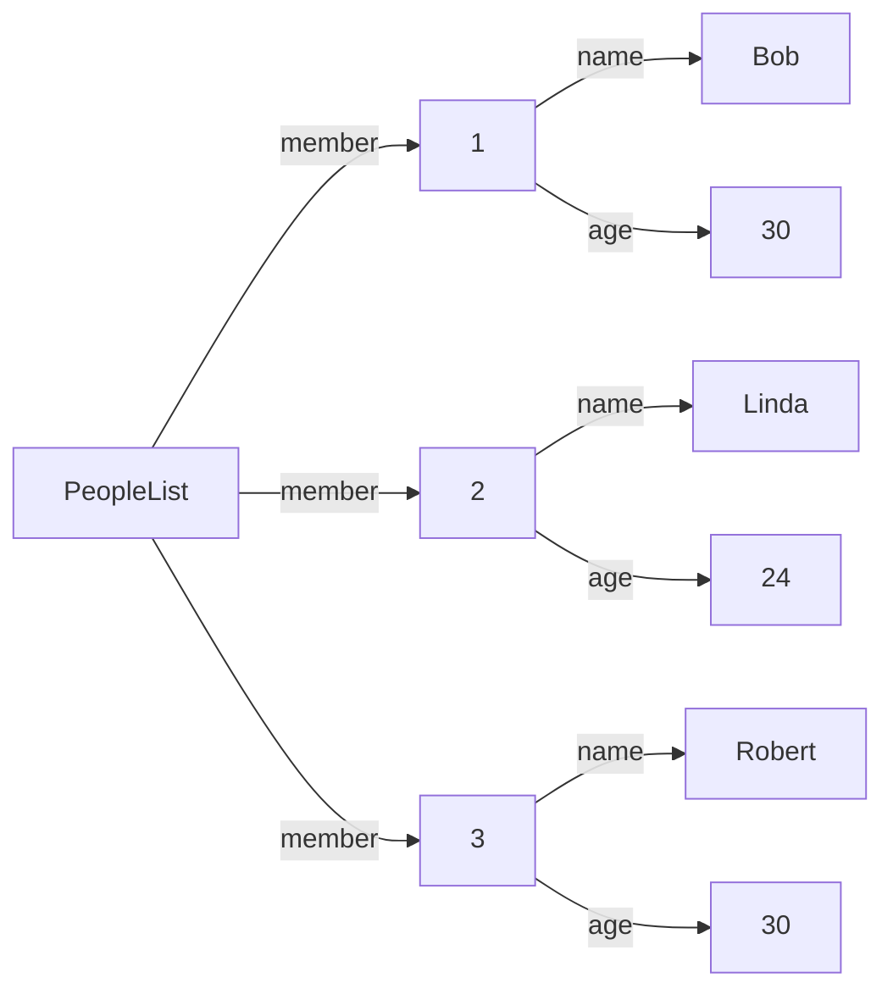
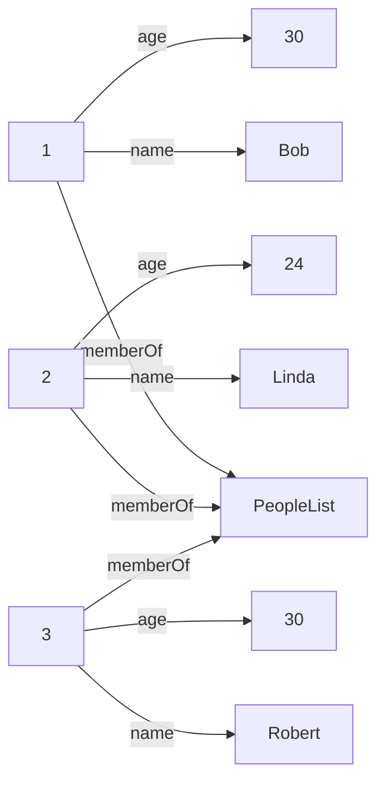
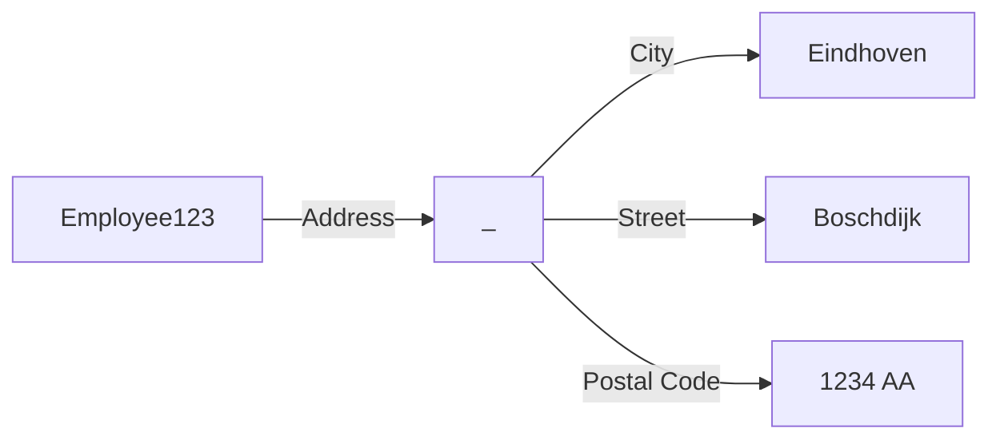

*by xokomola*

The word DATA comes from Latin and means something similar to Given Facts, Observations. It's plural and the singular form is DATUM. It comes from the verb "dare" which means "to give". Nowadays people often say "the data is not conclusive" or "the data are not conclusive".

When we put multiple datums together to form a structure, a data structure we can do that in many ways. Some forms you are probably already very comfortable with.

A single fact: Bob is thirty years old.

```yaml
name: Bob
age: 30
```

We can keep a list with the ages of multiple people.

- Bob is thirty years old
- Linda is twenty-four years old
- Robert is thirty years old

```yaml
- name: Bob 
  age: 30
- name: Linda
  age: 24
- name: Robert
  age: 30
```

We have represented the data in a YAML array (aka a list). We can ask probing questions about this simple data structure.

1. What if I have multiple people called "Bob" (or  Linda, or Vilem)? How can I represent them in the list?
2. Could "Bob" and "Robbert" describe the same person?
3. How do I know that 30 means 30 years? And would be 30.5 or 30,5 also be an acceptable value? Note that in JSON we would have to be explicit, at least with respect to being a number (30, 30.5) or string ("30", "30.5").

Each list item is an object (or map) but I could also look at it like a table with two columns.

| name   | age |
| ------ | --- |
| Bob    | 30  |
| Linda  | 24  |
| Robert | 30  |

Let's resolve questions 1. and 2. 

| id  | name   | age |
| --- | ------ | --- |
| 1   | Bob    | 30  |
| 2   | Linda  | 24  |
| 3   | Robert | 30  |





| Subject | Predicate | Object     |
| ------- | --------- | ---------- |
| 1       | name      | Bob        |
| 1       | age       | 30         |
| 2       | name      | Linda      |
| 2       | age       | 24         |
| 3       | name      | Robert     |
| 3       | name      | 30         |
| 1       | member    | PeopleList |
| 2       | member    | PeopleList |
| 3       | member    | PeopleList |

Now let's make the data more complicated. Let's add information about who knows who.

- Bob knows Robert
- Linda knows Robert

To make the data unambiguous we also have to answer a further question. Does knowing that Bob knows Robert also imply that Robert knows Bob. If, instead of "knows" we would have said "neighbour of" then we could probably assume this to be the case. If we would have said "follows" this may not necessarily be the case. Let's assume "knows" is, what's called a "transitive" property.


## Linked Data




| Name        | URI                                |
| ----------- | ---------------------------------- |
| Address     | https://schema.org/postalAddress   |
| City        | https://schema.org/addressLocality |
| Street      | https://schema.org/streetAddress   |
| Postal Code | https://schema.org/postalCode      |
