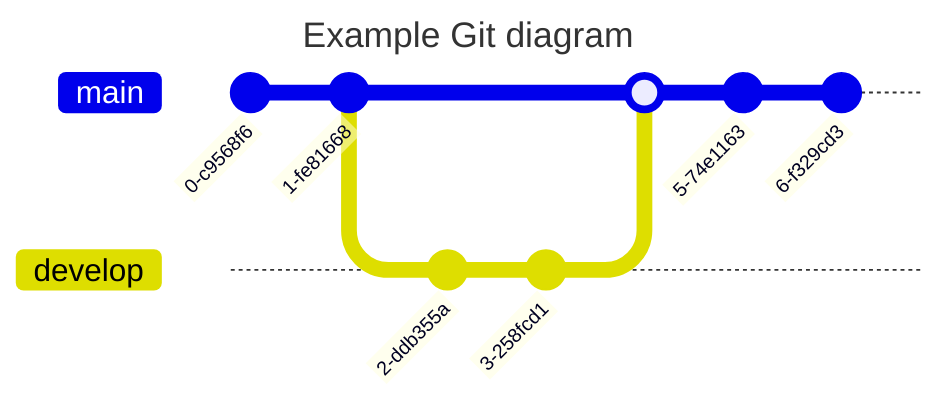

Which Markdown features are supported on this site. Most of these features should also work in [[Obsidian]].

Use the view source link to see how it looks as raw Markdown text.

## Notes and admonitions

> [!note] A Note
> Note text.

Code:

```
> [!note] A Note
> Note text.
```

Instead of `!note` you can also use `!abstract`, `!info`, `!tip`, `!success`, `!question`, `!warning`, `!failure`, `!danger`, `!bug`, `!example`, `!quote` to get a specific color and icon text box (admonition). Other words can be used to (like `!obsidian` below) but they will get a standard rendering color/icon. It's better to use a standard keyword and add the title after the keyword (like above with "A Note").

> [!bug] Bug alert
> This didn't go as expected.

You can also still use the plain quoted text block.

> this is a plain
> quoted block

Code:

```
> this is a plain
> quoted block
```

Note that these blocks can be nested (but admonitions like the ones above cannot be used nested inside a quoted block).

> Hello
> > Bla
> > Bla
> Goodby

> [!tip]
> Nesting
> > this works

## Lists

### Regular lists

Markdown always supports standard, nested, bulleted and numbered lists.

Unordered (bullets).

- Item
- Item
- Item

Ordered (numbered).

1. Item
2. Item

Mixed and nested.

- Item
	- Subitem
- Item
	1. Item
		1. Subitem
		2. Subitem
	2. Item

But we also support a couple of more advanced list types.

### Definition lists

**Term 1**

:   Term 1 definition.

**Term 2**

:   Term 2 definition.

    Another indented paragraph.

> [!note] Obsidian
> Will not show definition lists correctly and to get multiple paragraphs only the first paragraph will show in regular font.

### Task lists

-   [X] Item 1
    *   [X] Item A
    *   [ ] Item B
        More text
        +   [x] Item a
        +   [ ] Item b
        +   [x] Item c
    *   [X] Item C
-   [ ] Item 2
-   [ ] Item 3

> [!note] Obsidian
> The items can be toggled, which is then reflected in the Markdown.


## Code

Inline and block code highlighting.

```clojure
(cond (= 4) (+ 2 2))
```

```yaml
foo: 10
bar:
  - ABC
  - DEF
```

Adding a title

``` py title="bubble_sort.py"
def bubble_sort(items):
    for i in range(len(items)):
        for j in range(len(items) - 1 - i):
            if items[j] > items[j + 1]:
                items[j], items[j + 1] = items[j + 1], items[j]
```

Line numbers

``` py linenums="1"
def bubble_sort(items):
    for i in range(len(items)):
        for j in range(len(items) - 1 - i):
            if items[j] > items[j + 1]:
                items[j], items[j + 1] = items[j + 1], items[j]
```

Highlight specific lines.

``` py hl_lines="2 3"
def bubble_sort(items):
    for i in range(len(items)):
        for j in range(len(items) - 1 - i):
            if items[j] > items[j + 1]:
                items[j], items[j + 1] = items[j + 1], items[j]
```

The `#!python range()` function is used to generate a sequence of numbers.

Code block with annotations.

``` yaml
theme:
  features:
    - content.code.annotate # (1)
```

1.  :man_raising_hand: I'm a code annotation! I can contain `code`, __formatted
    text__, images, ... basically anything that can be written in Markdown.

> [!note] Obsidian
> Some attributes for the highlight blocks are not shown in Obsidian. You have to put the cursor in the code block to see the attributes.

## Footnotes

This text has a footnote[^foobar]!

[^foobar]: And this is the text for the footnote.

When publishing the notes will be collected and put at the end of the document (end notes).

## Math

For inline math start a span of math text with `$` and end with `$`. To get a block of math text start a block section with `$$` and end it with `$$` each marker starting in column 1 and on a line by itself.

This is $p(x|y) = \frac{p(y|x)p(x)}{p(y)}, (p(x|y) = \frac{p(y|x)p(x)}{p(y)})$ inline math.


This is a block of math.

$$
\begin{align}
    p(v_i=1|\mathbf{h}) & = \sigma\left(\sum_j w_{ij}h_j + b_i\right) \\
    p(h_j=1|\mathbf{v}) & = \sigma\left(\sum_i w_{ij}v_i + c_j\right)
\end{align}
$$

## Diagrams

To insert diagrams we use [Mermaid](https://mermaid.js.org) support. Here are some examples but consult the [Mermaid documentation](https://mermaid.js.org/intro) for more information. To see the raw Markdown text click the source view button (top right).

### Flowchart


### Sequence diagram


### Class Diagram


### State Diagram


### Entity Relationship Diagram


### User Journey


### Gantt Chart


### Pie Chart


### Quadrant Chart


### Gitgraph Diagram



### C4 Diagram


### Mindmaps


### Timeline


### Sankey Diagram


### XYChart


## Tables

Align left

| Method   | Description                          |
| -------- | ------------------------------------ |
| `GET`    | :material-check:     Fetch resource  |
| `PUT`    | :material-check-all: Update resource |
| `DELETE` | :material-close:     Delete resource |

Align center

| Method      | Description                          |
| :---------: | :----------------------------------: |
| `GET`       | :material-check:     Fetch resource  |
| `PUT`       | :material-check-all: Update resource |
| `DELETE`    | :material-close:     Delete resource |
Align right

| Method      | Description                          |
| ----------: | -----------------------------------: |
| `GET`       | :material-check:     Fetch resource  |
| `PUT`       | :material-check-all: Update resource |
| `DELETE`    | :material-close:     Delete resource |

> [!todo] TODO
> External files, Sortable columns


## Images


Code:

```

```

Like with hyperlinks we can also include images using wiki-style links.


![[activity-pub-mechanics.png]]

## Inline markup

This is **bold**, *italic*, and ***bolditalic***. Code `foo=10`. Keys: ++ctrl+alt+del++, ++a++.

Code:

```
This is **bold**, *italic*, and ***bolditalic***. 
Code `foo=10`. 
Keys: ++esc++, ++a++.
```

Super- and Subscript can be added using HTML tags or with special syntax (more convenient).

- H~2~O  (`H~2~O`)
- A^T^A (`A^T^A`)

## Highlighting text

- {==This was marked==}
- ~~This was deleted~~

{==This whole paragraph will be highlighted.==}

## Buttons

Not sure how useful this is, but we support simple buttons.

[Subscribe](#){ .md-button }

Code:

```
[Subscribe](#){ .md-button }
```
## Links

Inline hyperlink.

Code:

```
[Fontys](https://www.fontys.nl)
```

[Fontys](https://www.fontys.nl)

Code:

```
[Fontys](https://www.fontys.nl){:target="_blank"}
```

[Fontys](https://www.fontys.nl){:target="_blank"}


Explicit hyperlink to other document.

Code:

```
[Methods](Methods.md)
```

[Methods](Methods.md)

Wiki-links

Code:

```
[[xxxx]]
```

[[Methods]]


> [!note] Obsidian
> In Obsidian we prefer so called Wiki-links. These are easier to type and they are also supported.

## Content Tabs

> [!warning] Obsidian
> These are not displayed correctly by Obsidian but they seemed so useful that we did not want to exclude them.

The idea is to start every tab with `===`, when published this will become a panel where each section is shown as a separate tab.

=== "C"

	``` c
	#include <stdio.h>
	
	int main(void) {
	  printf("Hello world!\n");
	  return 0;
	}
	```

=== "C++"

	``` c++
	#include <iostream>
	
	int main(void) {
	  std::cout << "Hello world!" << std::endl;
	  return 0;
	}
	```

## HTML

HTML embedding is allowed but should be used sparingly. We may, one day, turn it off without notice.


