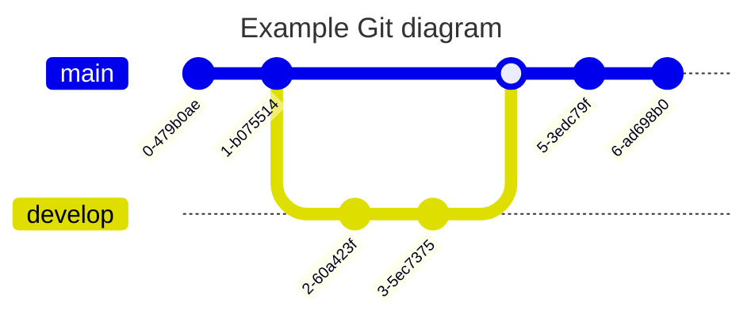

# Introduction

Documentation for 2024 Spring project. See [methods](methods.md){ data-preview }.

This page documents the various Markdown markup instructions. Some will not be supported in Obsidian but will only show correctly when rendered with Mkdocs.

## Admonitions

I am using the regular Obsidian[^ob] format for admonitions.

```
> [!note]
> This is a note.
```

> [!note] Note
> This is a note.

> [!quote] Johan says
> Als ik een fout maak dan maak ik 'm gewoon niet.

Supported admonition types: Note, Abstract, Info, Tip, Success, Question, Warning, Failure, Danger, Bug, Example.

[^ob]: This is a footnote!

## Annotations

Provides a way to add annotations, give inline comments.

Lorem ipsum dolor sit amet, (1) consectetur adipiscing elit.
{ .annotate }

1.  :man_raising_hand: I'm an annotation! (1)
    { .annotate }

    1.  :woman_raising_hand: I'm an annotation as well!


## Attribute lists

Add HTML attributes and CSS classes to almost every Markdown inine- and block-level element.

You can use them for creating various things (X)

[Hover me](https://example.com "I'm a tooltip!")

[Hover me]{title="Important!"}

[Hover me][example]
	[example]: https://example.com "I'm a tooltip!"

Abbreviations (X)

The HTML specification is maintained by the W3C.

*[HTML]: Hyper Text Markup Language
*[W3C]: World Wide Web Consortium

## Images


> [!tip]
> The Wikilinks notation will not work (`![[image.png]]`) with Obsidian.

{align=left width=300}

Lorem ipsum dolor sit amet, consectetur adipiscing elit. Nulla et euismod nulla. Curabitur feugiat, tortor non consequat finibus, justo purus auctor massa, nec semper lorem quam in massa.


<figure markdown>
  { width="300" }
  <figcaption>Image caption</figcaption>
</figure>

## Buttons

[Subscribe](#){ .md-button }

[Send :fontawesome-solid-paper-plane:](#){ .md-button }

## Keys

- 
- Keys
	- ++esc++
	- ++k++  ++e++ ++y++ ++s++
- Mark
	- ==mark me==
	- ==smart=mark==
	- bla

## Code

Inline and block code highlighting.

```clojure
(cond (= 4) (+ 2 2))
```

```yaml
foo: 10
bar:
  - ABC
  - DEF
```

Adding a title

``` py title="bubble_sort.py"
def bubble_sort(items):
    for i in range(len(items)):
        for j in range(len(items) - 1 - i):
            if items[j] > items[j + 1]:
                items[j], items[j + 1] = items[j + 1], items[j]
```

Line numbers

``` py linenums="1"
def bubble_sort(items):
    for i in range(len(items)):
        for j in range(len(items) - 1 - i):
            if items[j] > items[j + 1]:
                items[j], items[j + 1] = items[j + 1], items[j]
```

Highlight specific lines.

``` py hl_lines="2 3"
def bubble_sort(items):
    for i in range(len(items)):
        for j in range(len(items) - 1 - i):
            if items[j] > items[j + 1]:
                items[j], items[j + 1] = items[j + 1], items[j]
```

The `#!python range()` function is used to generate a sequence of numbers.

Code block with annnotations.

``` yaml
theme:
  features:
    - content.code.annotate # (1)
```

1.  :man_raising_hand: I'm a code annotation! I can contain `code`, __formatted
    text__, images, ... basically anything that can be written in Markdown.


## Content tabs

Does not look good in Obsidian but works. To get code highlighting in Obsidian we need to dedent. But this will not render correctly.

=== "C"

	``` c
	#include <stdio.h>
	
	int main(void) {
	  printf("Hello world!\n");
	  return 0;
	}
	```

=== "C++"

	``` c++
	#include <iostream>
	
	int main(void) {
	  std::cout << "Hello world!" << std::endl;
	  return 0;
	}
	```

This is a tabbed box with regular content.

=== "Unordered list"

    * Sed sagittis eleifend rutrum
    * Donec vitae suscipit est
    * Nulla tempor lobortis orci

=== "Ordered list"

    1. Sed sagittis eleifend rutrum
    2. Donec vitae suscipit est
    3. Nulla tempor lobortis orci

## Data tables

Align left

| Method      | Description                          |
| ----------- | ------------------------------------ |
| `GET`       | :material-check:     Fetch resource  |
| `PUT`       | :material-check-all: Update resource |
| `DELETE`    | :material-close:     Delete resource |

Align center

| Method      | Description                          |
| :---------: | :----------------------------------: |
| `GET`       | :material-check:     Fetch resource  |
| `PUT`       | :material-check-all: Update resource |
| `DELETE`    | :material-close:     Delete resource |
Align right

| Method      | Description                          |
| ----------: | -----------------------------------: |
| `GET`       | :material-check:     Fetch resource  |
| `PUT`       | :material-check-all: Update resource |
| `DELETE`    | :material-close:     Delete resource |

- TODO: sortable
- TODO: external files (CSV/Excel)

## Diagrams





## Chapter 2

! tilde strikethrough does not work yet
! choose

Foo~~bar~~!!!

Instead use it only for sub/superscript. Or rather, use caret extension.

H^2^O and ^^insert me^^

CH~3~CH~2~OH

Then use PyMdown critic for marking text ++added++, --removed--.

{--

* test remove
* test remove
* test remove
    * test remove
* test remove

--}

{++

* test add
* test add
* test add
    * test add
* test add

++}

### Math (TODO)

This is $p(x|y) = \frac{p(y|x)p(x)}{p(y)}, (p(x|y) = \frac{p(y|x)p(x)}{p(y)})$ inline math.


This is a block of math.

$$
E(\mathbf{v}, \mathbf{h}) = -\sum_{i,j}w_{ij}v_i h_j - \sum_i b_i v_i - \sum_j c_j h_j

[3 < 4]

\begin{align}
    p(v_i=1|\mathbf{h}) & = \sigma\left(\sum_j w_{ij}h_j + b_i\right) \\
    p(h_j=1|\mathbf{v}) & = \sigma\left(\sum_i w_{ij}v_i + c_j\right)
\end{align}
$$


## Lists

### Unordered lists

- Nulla et rhoncus turpis. Mauris ultricies elementum leo. Duis efficitur
  accumsan nibh eu mattis. Vivamus tempus velit eros, porttitor placerat nibh
  lacinia sed. Aenean in finibus diam.
    * Duis mollis est eget nibh volutpat, fermentum aliquet dui mollis.
    * Nam vulputate tincidunt fringilla.
    * Nullam dignissim ultrices urna non auctor.

### Ordered lists

1.  Vivamus id mi enim. Integer id turpis sapien. Ut condimentum lobortis
    sagittis. Aliquam purus tellus, faucibus eget urna at, iaculis venenatis
    nulla. Vivamus a pharetra leo.
    1.  Vivamus venenatis porttitor tortor sit amet rutrum. Pellentesque aliquet
        quam enim, eu volutpat urna rutrum a. Nam vehicula nunc mauris, a
        ultricies libero efficitur sed.
    2.  Morbi eget dapibus felis. Vivamus venenatis porttitor tortor sit amet
        rutrum. Pellentesque aliquet quam enim, eu volutpat urna rutrum a.
        1.  Mauris dictum mi lacus
        2.  Ut sit amet placerat ante
        3.  Suspendisse ac eros arcu

### Definitions lists

`Lorem ipsum dolor sit amet`

:   Sed sagittis eleifend rutrum. Donec vitae suscipit est. Nullam tempus
    tellus non sem sollicitudin, quis rutrum leo facilisis.

`Cras arcu libero`

:   Aliquam metus eros, pretium sed nulla venenatis, faucibus auctor ex. Proin
    ut eros sed sapien ullamcorper consequat. Nunc ligula ante.

    Duis mollis est eget nibh volutpat, fermentum aliquet dui mollis.
    Nam vulputate tincidunt fringilla.
    Nullam dignissim ultrices urna non auctor.


### Tasklist

-   [X] item 1
    *   [X] item A
    *   [ ] item B
        more text
        +   [x] item a
        +   [ ] item b
        +   [x] item c
    *   [X] item C
-   [ ] item 2
-   [ ] item 3

## Creative commons license

<div style="width:95%; margin:auto;">
  <a rel="license" href="http://creativecommons.org/licenses/by-sa/4.0/"></a>
  This work is licensed under a Creative Commons Attribution 4.0 ShareAlike License (including images & stylesheets).
</div>

